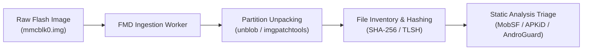

## Overview

Over the past few years, inexpensive Android-powered streaming boxes—frequently powered by AllWinner (e.g., H616, H313) or Rockchip (e.g., RK3328) System-on-Chips (SoCs)—have proliferated across international e-commerce platforms. Marketed as low-cost media centers capable of 4K streaming, many of these devices lack Google Play Protect certification and ship with customized Android Open Source Project (AOSP) firmware builds.

As part of a broader research initiative, we investigated budget IoT streaming hardware for security vulnerabilities and factory-installed malware. A primary focal point was **residential proxy networks**, which recent industry reports have repeatedly identified embedded within inexpensive Android TV appliances. 

In this case study, we document the physical teardown, hardware-level firmware extraction, and subsequent static analysis of two off-the-shelf Android TV set-top boxes using **FirmwareDroid (FMD)**.

---

## Supply Chain & Threat Model

Off-brand Android TV devices operate within an opaque global supply chain where hardware manufacturers, turnkey board-solution providers, and secondary firmware resellers operate independently.

```
[OEM / Chipset Vendor]
        │  Reference BSP & Kernel
        ▼
[White-Label Solution Provider]
        │  Adds launcher & system apps (Malware injection point A)
        ▼
[Device Reseller / Brand Wholesaler]
        │  Customizes ROM with ad syndicates (Malware injection point B)
        ▼
[End Consumer]
        Receives pre-compromised hardware out of the box
```

Because these devices are not subject to Google's Compatibility Test Suite (CTS) or Google Mobile Services (GMS) licensing agreements, they undergo zero mandatory pre-market vetting. Threat actors exploit this lack of oversight to embed monetization malware, click-fraud frameworks, or residential proxy nodes directly into the read-only `/system` partition prior to commercial packaging and distribution.

---

## Background & Motivation

Our initial methodology attempted to dynamically monitor and analyze network traffic emitted by the set-top boxes, looking for anomalous request-response flows indicative of proxy or botnet activity. However, this approach presented two fundamental limitations:

1. **Encrypted Payloads without TLS Interception:** Without breaking TLS connections, network analysis was strictly confined to transport metadata, connection targets, and DNS queries. While metadata provides useful heuristics, inspecting the exact operations and payloads of suspicious daemons requires deeper payload visibility.
2. **Non-Deterministic and Delayed Activation:** Residential proxy clients and click-fraud malware rarely trigger immediately upon first boot. Payloads routinely implement sleep timers, require external Command-and-Control (C2) activation signals, or wait for specific user interactions before launching background threads.

To circumvent these limitations, we pivoted to **hardware-based firmware extraction** followed by comprehensive static analysis using FirmwareDroid.

---

## Hardware Inspection & Opening the Devices

For this study, we purchased two popular budget set-top boxes from Temu:
- **Wudung Android Mini TV Box**
- **XC99 Max Android TV Box**

<div style="display: grid; grid-template-columns: repeat(auto-fit, minmax(280px, 1fr)); gap: 1.5rem; margin: 1.8rem 0;">
  <figure style="margin: 0;">
    
    <figcaption style="font-size: 0.8rem; color: var(--muted); text-align: center; margin-top: 0.5rem; font-family: var(--mono);">Wudung Android Mini TV Box</figcaption>
  </figure>
  <figure style="margin: 0;">
    
    <figcaption style="font-size: 0.8rem; color: var(--muted); text-align: center; margin-top: 0.5rem; font-family: var(--mono);">XC99 Max Android TV Box</figcaption>
  </figure>
</div>

Opening both enclosures revealed accessible **UART (Universal Asynchronous Receiver-Transmitter)** interfaces. While common on development and reference boards, production consumer hardware frequently has UART test pads removed, unpopulated, or disabled at the silicon level. 

Fortunately, both boards exposed unpopulated pin headers with active serial logging enabled by default, granting direct access to the device bootloaders.

---

## Firmware Extraction

### 1. XC99 Max Android TV Box: TFTP over Ethernet

Connecting to the UART interface of the XC99 Max allowed us to interrupt the boot sequence and enter the **U-Boot** bootloader environment. As is characteristic of white-label embedded hardware, the vendor relied on an unmaintained U-Boot fork dating back to 2014.

<figure style="margin: 1.8rem 0;">
  
  <figcaption style="font-size: 0.8rem; color: var(--muted); text-align: center; margin-top: 0.5rem; font-family: var(--mono);">XC99 Max mainboard featuring SoC, eMMC flash, UART test pads, and 100M Ethernet port</figcaption>
</figure>

The XC99 Max board offered several potential extraction avenues. We selected the onboard Ethernet interface, leveraging U-Boot's built-in TFTP client:

- **Chunk Size Constraints:** While standard TFTP can support transfers up to 32&nbsp;MB per session, the outdated bootloader implementation consistently crashed when handling transfers larger than 16&nbsp;MB.
- **RAM Allocation:** We identified a contiguous, unallocated 256&nbsp;MB segment in device RAM to stage data copied from flash memory before transmitting it to our TFTP host.
- **Transfer Strategy:** For an approximately 8&nbsp;GB total flash image, the firmware had to be dumped in 512 discrete 16&nbsp;MB chunks across multiple iterations.

The transfer sequence proceeded as follows:
1. Copy 256&nbsp;MB from eMMC flash memory to RAM using the U-Boot `mmc read` command.
2. Push the data to the host workstation in sixteen consecutive 16&nbsp;MB TFTP packets (`tftpput`).
3. Repeat across subsequent eMMC block offsets until the entire storage space was dumped.
4. Concatenate and verify the chunks on the host machine.

Because manual orchestration would have taken hours, we automated the interaction using a Minicom expect script:

```bash
print "Synchronizing with U-Boot..."
send ""
expect "fastboot#"

print "Loading MMC chunk 1/32 into RAM..."
send "mmc read 0 0x10000000 0x0 0x080000"
expect "fastboot#"

print "Uploading sub-chunk 1 via TFTP..."
send "tftpput 0x10000000 0x1000000 /tftpboot/mmc_001.bin"
expect "fastboot#"

print "Uploading sub-chunk 2 via TFTP..."
send "tftpput 0x11000000 0x1000000 /tftpboot/mmc_002.bin"
expect "fastboot#"
# ... sequence continues through mmc_512.bin ...
```

Due to memory leak bugs in the 2014 U-Boot codebase, the bootloader occasionally crashed every 20–30 chunks, requiring a power cycle and script resumption at the last committed offset. Within approximately two hours, all 512 raw chunks were retrieved and reassembled into a valid 8&nbsp;GB raw disk image.

---

### 2. Wudung Android Mini TV Box: Root Shell & USB Dump

The Wudung Mini TV Box presented a substantially smaller form factor with fewer physical interfaces. Crucially, it lacked an RJ-45 Ethernet port.

<div style="display: grid; grid-template-columns: repeat(auto-fit, minmax(280px, 1fr)); gap: 1.5rem; margin: 1.8rem 0;">
  <figure style="margin: 0;">
    
    <figcaption style="font-size: 0.8rem; color: var(--muted); text-align: center; margin-top: 0.5rem; font-family: var(--mono);">Wudung board (top view with Wi-Fi antenna and USB)</figcaption>
  </figure>
  <figure style="margin: 0;">
    
    <figcaption style="font-size: 0.8rem; color: var(--muted); text-align: center; margin-top: 0.5rem; font-family: var(--mono);">Wudung board (bottom view with SoC and flash storage)</figcaption>
  </figure>
</div>

While we could access U-Boot over UART, initializing the onboard Wi-Fi chip without proprietary firmware blobs in the pre-boot environment proved impractical.

Instead, we leveraged the bootloader to alter the kernel boot arguments, appending `init=/bin/sh` to drop directly into an unauthenticated root shell upon kernel initialization. Once inside the embedded Linux environment:

1. We inserted an external USB drive into the box's single USB 2.0 port.
2. Mounted the external filesystem under `/mnt/usb`.
3. Executed a direct raw copy of the internal storage block device using `dd`:

```bash
dd if=/dev/block/mmcblk0 of=/mnt/usb/wudung_firmware_raw.img bs=4M status=progress
```

This extraction completed in under 10 minutes—proving substantially faster, simpler, and more reliable than TFTP over Ethernet.

---

## Static Analysis with FirmwareDroid

Once the raw flash images were reconstructed, we ingested both images into **FirmwareDroid** using its automated pipeline:



### 1. Partition Disassembly and Inventory
FirmwareDroid unpacked the partition table, locating the sparse `system.img` and `vendor.img` containers. Traversal of the filesystem exposed:
- **142 pre-installed Android packages (`.apk`)** across `/system/app/` and `/system/priv-app/`.
- **38 custom native binaries and daemons** residing under `/system/bin/` and `/vendor/bin/`.

### 2. High-Severity Findings

FMD's integrated static analysis engines highlighted several critical security risks:

RESULTS TO BE RELEASED SOON: The detailed findings, including specific package names, hashes, and behavioral analysis of the discovered malware components, will be published soon.

---

## Limitations & Future Work

While our static extraction pipeline successfully recovered full, byte-accurate firmware images from both TV set-top boxes, several methodological limitations remain:

1. **Over-The-Air (OTA) Delivery Vectors:** Static inspection captures the factory ROM state. Malicious components delivered downstream via scheduled manufacturer OTA updates or dynamic in-app updates require periodic differential analysis over time.
2. **Dynamic TLS Interception:** Gaining end-to-end visibility into live C2 communication requires transparent TLS proxying. Automated patching of Android network security configurations (`network_security_config.xml`) directly within FMD is planned to facilitate automated MITM interception.
3. **Large-Scale Multi-Device Testbeds:** Expanding this empirical study to hundreds of low-cost streaming devices requires automating hardware dumping via multiplexed serial testbeds.
