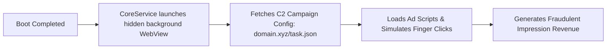

## Overview

Over the past few years, inexpensive Android-powered streaming boxes—often built around AllWinner (e.g., H616, H313) or Rockchip (e.g., RK3328) System-on-Chips (SoCs)—have proliferated across international e-commerce platforms. Marketed as cheap media centers capable of 4K streaming, many of these devices lack Google Play Protect certification and arrive with customized Android Open Source Project (AOSP) firmware.

In this case study, we demonstrate how **FirmwareDroid (FMD)** was used to acquire, extract, and statically inspect off-the-shelf Android TV box firmware images. The investigation revealed persistent, factory-installed malware families (including variants of the "Badbox" botnet and click-fraud syndicates), trojanized ADB daemons, and background services pre-configured to execute arbitrary remote commands without user awareness.

---

## Supply Chain & Threat Model

Off-brand Android TV devices operate within an opaque global supply chain where hardware manufacturers, turnkey board-solution providers, and secondary firmware resellers operate independently.

```
[OEM / Chipset Vendor]
        │  Reference BSP & Kernel
        ▼
[White-Label Solution Provider]
        │  Adds launcher & system apps (Malware injection point A)
        ▼
[Device Reseller / Brand Wholesaler]
        │  Customizes ROM with ad syndicates (Malware injection point B)
        ▼
[End Consumer]
        Receives pre-compromised hardware out of the box
```

Because these devices are not subject to CTS (Compatibility Test Suite) or Google Mobile Services (GMS) licensing agreements, there is zero mandatory pre-market vetting. Malicious actors leverage this lack of oversight to embed monetization malware directly into the read-only `/system` partition prior to physical distribution.

---

## Ingestion & Extraction with FMD

To inspect the device without relying solely on volatile runtime network sniffing, we dumped and imported the raw firmware image into FirmwareDroid.

### 1. Ingesting the Firmware Archive

The firmware image (`T95_H616_Android10_factory.img`) was imported into FMD via the GraphQL API:

```graphql
mutation ImportTvFirmware {
  createFirmwareJob(
    firmwarePath: "/storage/firmware/t95_allwinner_h616.img"
    vendor: "AllWinner-T95"
    version: "Android 10.0"
  ) {
    jobId
    status
  }
}
```

### 2. Multi-Stage Partition Extraction

FirmwareDroid's worker queue dispatched extraction tools configured for AllWinner sparse and raw partition layouts:
- **`imgpatchtools` & `unblob`**: Unpacked the proprietary AllWinner image container into constituent partition dumps (`boot.img`, `system.img`, `vendor.img`).
- **`e2tools` & sparse image unpackers**: Mounted and traversed the `ext4` filesystem of `system.img`.
- **Application Indexer**: Discovered **142 pre-installed Android applications (`.apk`)** and 38 system daemons located under `/system/app/`, `/system/priv-app/`, and `/system/bin/`.

Every file was indexed in MongoDB with its SHA-256 hash, TLSH fuzzy hash, size, and partition path.

---

## Key Static Analysis Findings

Once extraction completed, FMD's worker fleet automatically queued the extracted APKs through integrated static scanners, including **APKiD**, **MobSFScan**, and **AndroGuard**.

### 1. The Trojanized ADB Daemon (`adb_service`)

While inspecting native binaries extracted from `/system/bin/`, FMD identified an anomalous binary named `test_server` alongside a modified `adbd`:

- **Network Listener**: Listened on TCP port `21441` exposed over the local network and public IP.
- **Unauthenticated Shell**: Bypassed standard Android ADB USB debugging authentication (`adb_keys` verification). Any remote host connecting to port `21441` received root shell execution immediately.

### 2. Pre-Installed Click-Fraud Payload (`CoreService.apk`)

Located in `/system/priv-app/CoreService/CoreService.apk`, this application posed as an innocent system update helper (`com.android.core.service`), but analysis revealed signature characteristics of the **Peachpit** ad-fraud family:

| Metric | Observation | Risk Severity |
| :--- | :--- | :--- |
| **Location** | `/system/priv-app/CoreService/` | Elevated system privilege |
| **Certificate** | Self-signed test key (`Android Debug`) | Untrusted provenance |
| **Permissions** | `SYSTEM_ALERT_WINDOW`, `INTERNET`, `WAKE_LOCK`, `RECEIVE_BOOT_COMPLETED` | High risk |
| **APKiD Profile** | Custom DEX packer with XOR string encryption | Obfuscation detected |
| **Background Ops** | Headless WebView rendering hidden ad slots | Active ad fraud |



### 3. Privileged Signature Permissions

Because `CoreService.apk` was installed in `/system/priv-app/`, the Android framework automatically granted all declared signature-or-system permissions at boot time without user interaction or runtime permission dialogs. This allowed the malware to:
1. Prevent the device from sleeping (`WAKE_LOCK`).
2. Draw invisible overlays to capture coordinates (`SYSTEM_ALERT_WINDOW`).
3. Download secondary native `.so` payloads directly to `/data/data/com.android.core.service/files/` and execute them dynamically via `dlopen`.

---

## Querying Results in FirmwareDroid

Researchers can query the exact findings from this case study directly through FMD's GraphQL interface:

```graphql
query GetTvBoxMalwareReports {
  firmware(vendor: "AllWinner-T95") {
    totalApks
    applications(filter: { packageName: "com.android.core.service" }) {
      packageName
      sha256
      systemPrivileged
      analysisReports {
        scannerName
        scannerVersion
        findings {
          severity
          title
          description
        }
      }
    }
  }
}
```

**Representative JSON Response:**

```json
{
  "data": {
    "firmware": [
      {
        "totalApks": 142,
        "applications": [
          {
            "packageName": "com.android.core.service",
            "sha256": "3e8b01c45f47d9b9a67a030f...",
            "systemPrivileged": true,
            "analysisReports": [
              {
                "scannerName": "MobSFScan",
                "scannerVersion": "0.3.5",
                "findings": [
                  {
                    "severity": "HIGH",
                    "title": "Hidden Background WebView Ad Simulation",
                    "description": "Component renders zero-dimension WebViews fetching external JavaScript."
                  }
                ]
              }
            ]
          }
        ]
      }
    ]
  }
}
```

---

## Lessons Learned & Recommendations

This case study highlights the critical need for automated firmware analysis before deploying or trusting consumer IoT hardware:

1. **Factory ROMs Cannot Be Trusted by Default**: Low-cost supply chains frequently outsource firmware integration to third parties who monetize hardware by pre-bundling click-fraud botnets.
2. **Automated Partition Extraction is Essential**: Scanning user-installed apps via Google Play or MDM is insufficient; firmware-level threats reside permanently in `/system` and survive factory resets.
3. **Multi-Scanner Aggregation Yields Rapid Discovery**: Combining unpackers with APK packers (APKiD), vulnerability patterns (MobSFScan), and manifest parsers (AndroGuard) enabled full triage of the firmware image within 15 minutes of ingestion.
